# ESP32 BLE Gamepad
This branch contains a project that is composed of both hardware and software stacks for a gamepad based on ESP32-C3. This project is started based on a personal need for a button pad to control OBS while playing games.

The information and experience gathered from this project will be used for the following potential projects
- Racing sim wheel
- Racing sim button stack
- Flight sim controls

## Hardware
I picked ESP32-C3 because I have a ton of them laying around. The idea is to build a fully functional Bluetooth game pad.

### Design considerations
- The actual Dev board I have is ESP32-C3 Super mini. Due to its size, it only has 11 GPIO to safely use after removing two buttons, for the Boot button and the LED. 11 buttons will be more than enough for the initial version for controlling OBS.
- The shell will be 3d printed
- Mechnical keyboard switches are going to be used for buttons

### BOM
- [x] ESP32-C3 Super mini
- [x] Shell
- [x] Switches
- [x] Key caps

#### ESP32-C3 Gamepad
I although it is possible to have 11 buttons, I opted to use only 10 of them because that looks batter.
It may be possible to have more buttons given that there are more GPIOs than 11, some pins GPIO8 and GPIO9, are wired for some other functions, built-in LED and BOOT pin respectively.

Ultimately, I have used GPIO0-7, 10, and 20 for button 1-10.

#### 3D prints
You can find STL files in the `/hardware/3d-models` location.

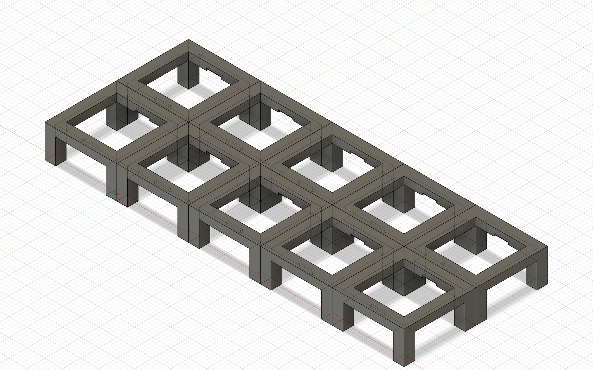
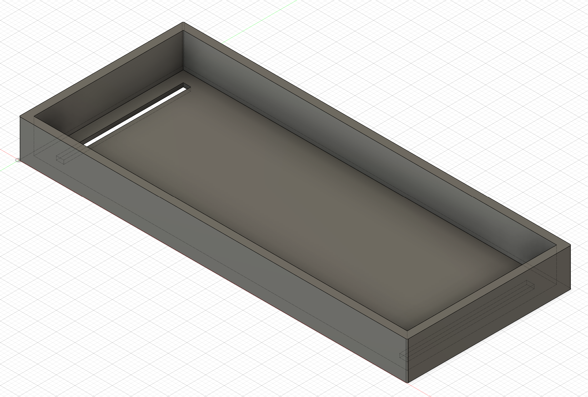
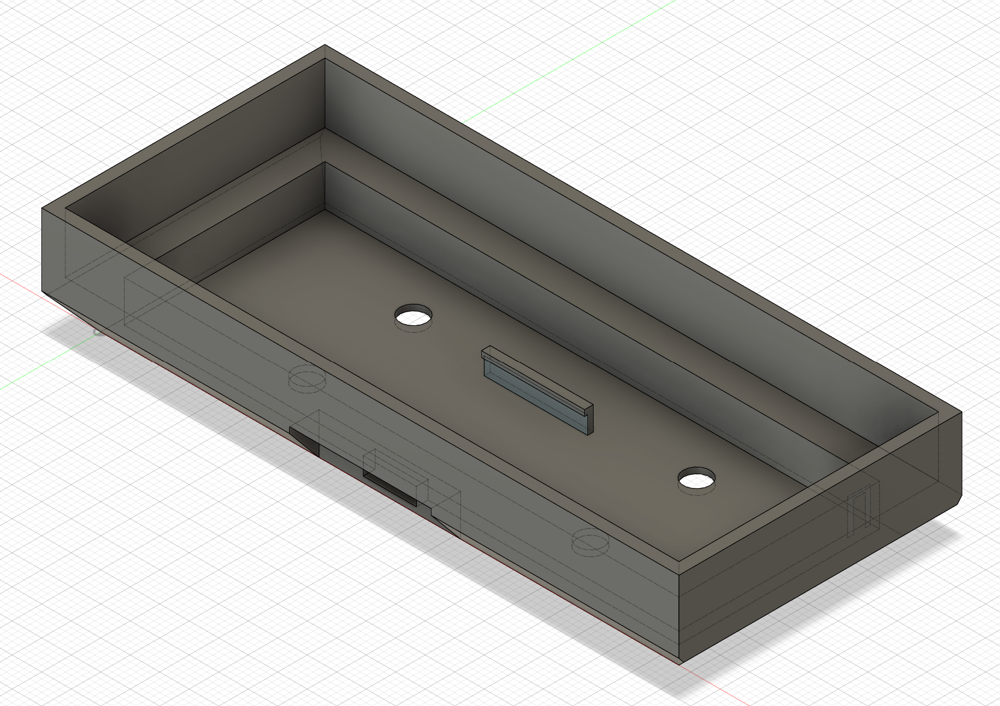
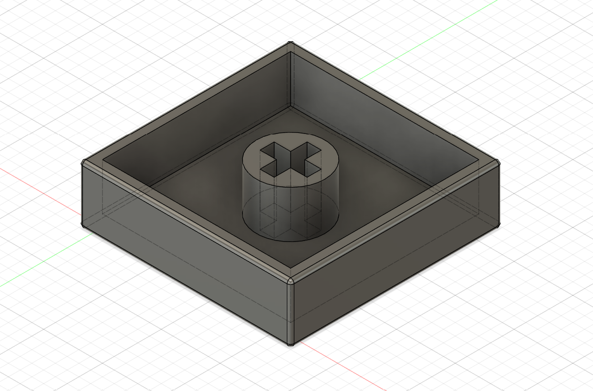

#### Assembly
I would like to build a shell that is easy to assemble and disassemble because everyone knows the prototype device requires a lot of both.

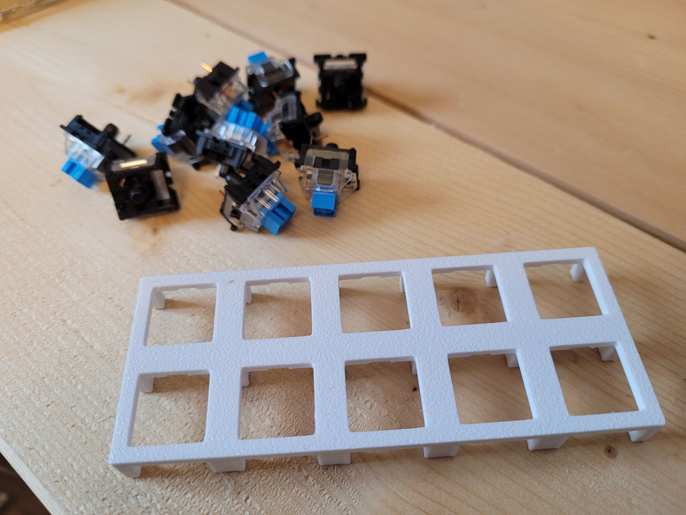
First off, I wanted to created a grid that I can easily put the switches in. The dimensions are based on Cherry style switches with notches on top and bottom sides to ensure the switches to slot in tightly.

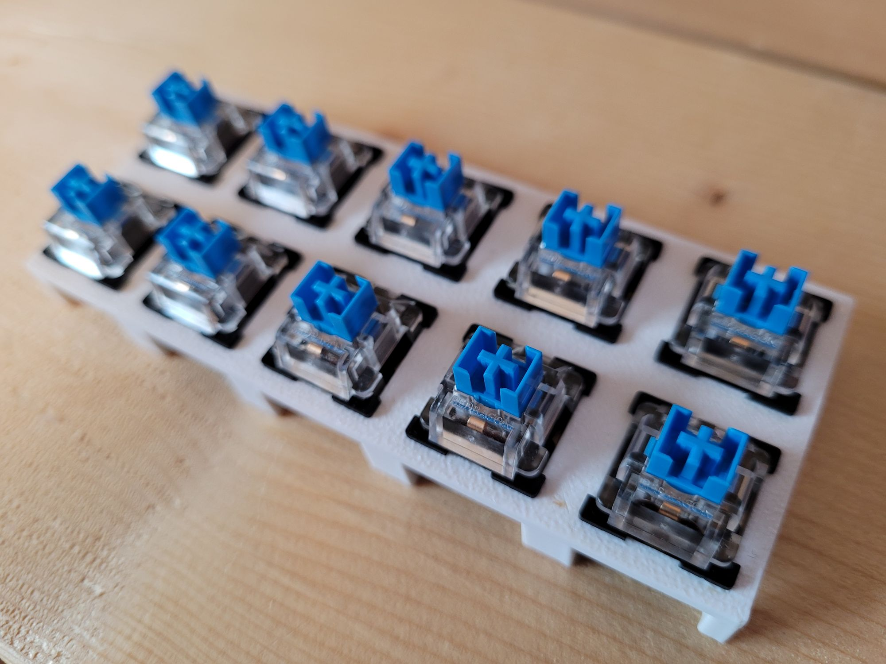
This is how it looks after all the buttons are installed.
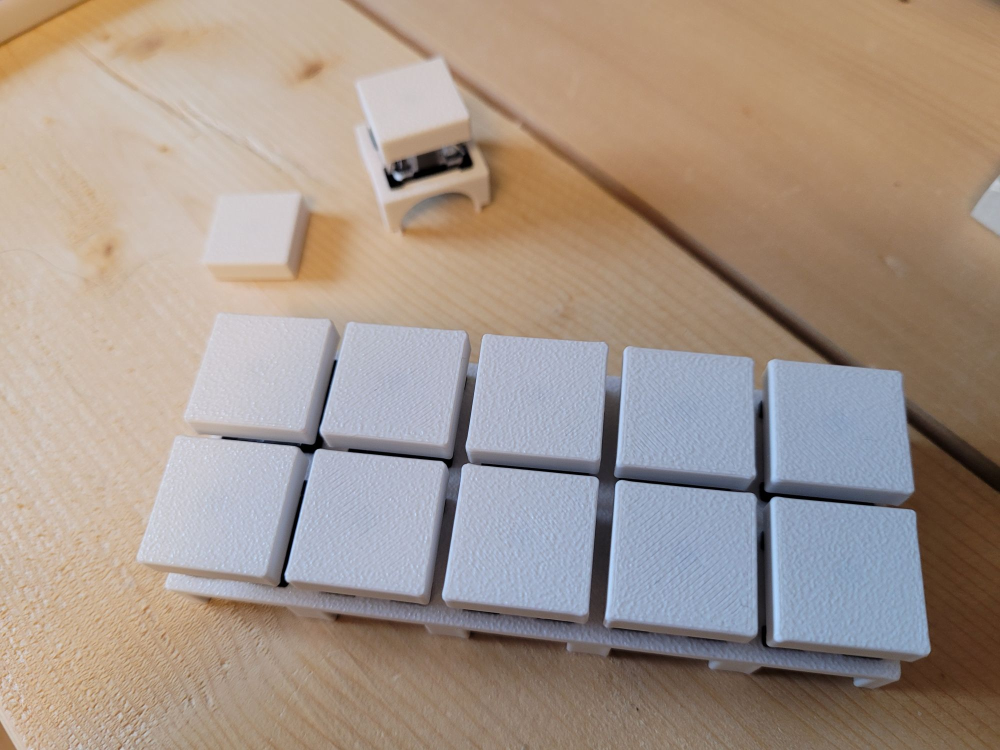
I have designed the buttons caps to be flat. This is not a keyboard after all and slight concave shape usually found in keyboards are not really necessary.

I found that it is really annoying that the switches themselves have quite a bit of slack when I wiggle them. What I have bought is probably a low quality one, but I do not remember what I have bought. They were probably the cheapest decent looking ones from AliExpress. They look aligned enough for me, but that is not acceptable for some people.
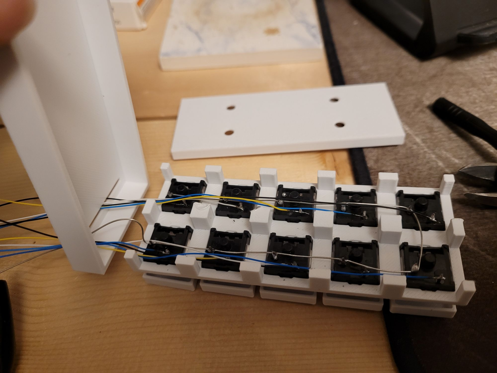

For Rev.1, I decided to solder all the buttons. Eventually, I want to designe a PCB for it but that is for the future.
If you see it closely, I have two slots on the bottom cover to route the wires. Originally, I created some snap fit tabs on the mount to help hold pieces together but I have failed to create a strong enough tap for multiple assembly/disassemlby cycles. After about 10 failed prototypes, I just gave up, leaving two slots for wires instead of a single slot.

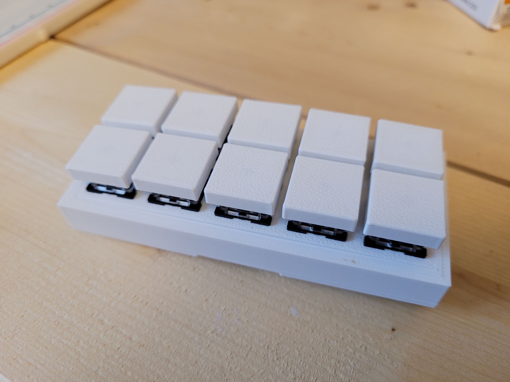
It is very easy to assembly this. All you have to do is to put the grid into the cover, then the whole cover+grid assembly into the mount. The natural layer lines of 3D prints create enough friction to hold the assembly quite tightly. One unexpected thing is that the disassembly is actually quite hard because the friction was way too high. I can probably open it up with enough force but I was not in a mood to print another shell after 10+ failed prototypes.

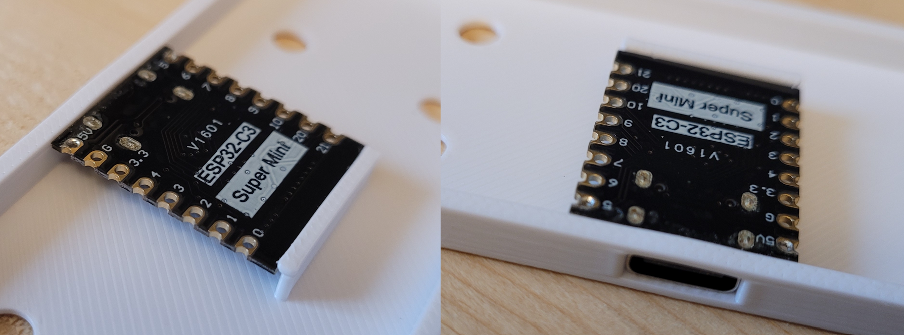
The downside of this is that I was not able to take a photo of how ESP32-C3 Super mini is mounted. I just took photos using one of the failed prototype for this because the idea is the same. When looking at the ESP32 module, the USB port is slightly extruded out of the PCB. Using that, I created a slot in the side of the mount to push the port in, and exact distance away, I created a wall with slight tab at the top of it. Because 3D prints using PLA has enough flex on them, I could jam the moudle in with a bit of force. It is very tightly fit without any issues so far. There may be some issues with stress overtime.

#### Arduino Code
A single code of the ESP32-C3 can be found in [This location](hardware/ble-gamepad/ble-gamepad.ino). The code itself is slightly modified version of an example that can be found with [NimBLE-Arduino](https://github.com/h2zero/NimBLE-Arduino) library. 

#### Simple tests
Without the software stack to use it as a OSB controller, it is still a perfectly good game controller. First, pair it using Bluetooth.
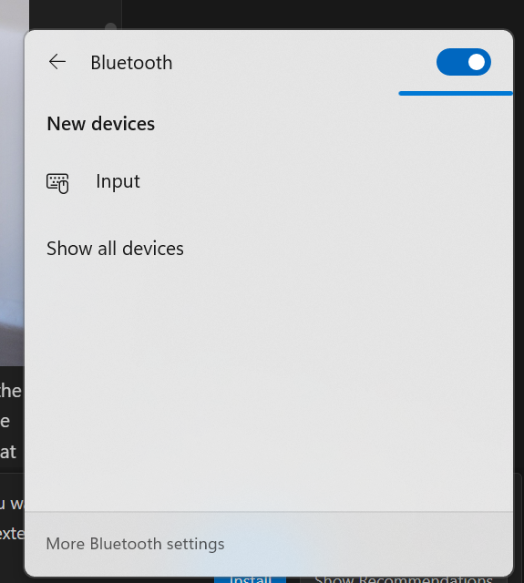
Before pair
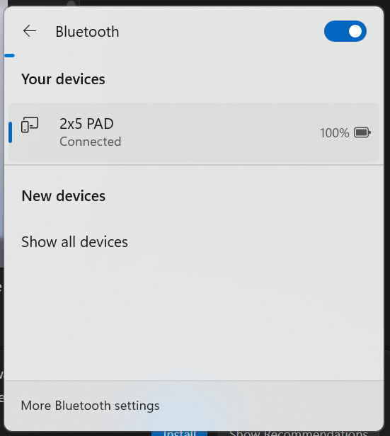
After pair

It shows up an Input device, then shows the name after the pairing is done. You can see it says `2x5 PAD`. You can control this name in the Arduino code.
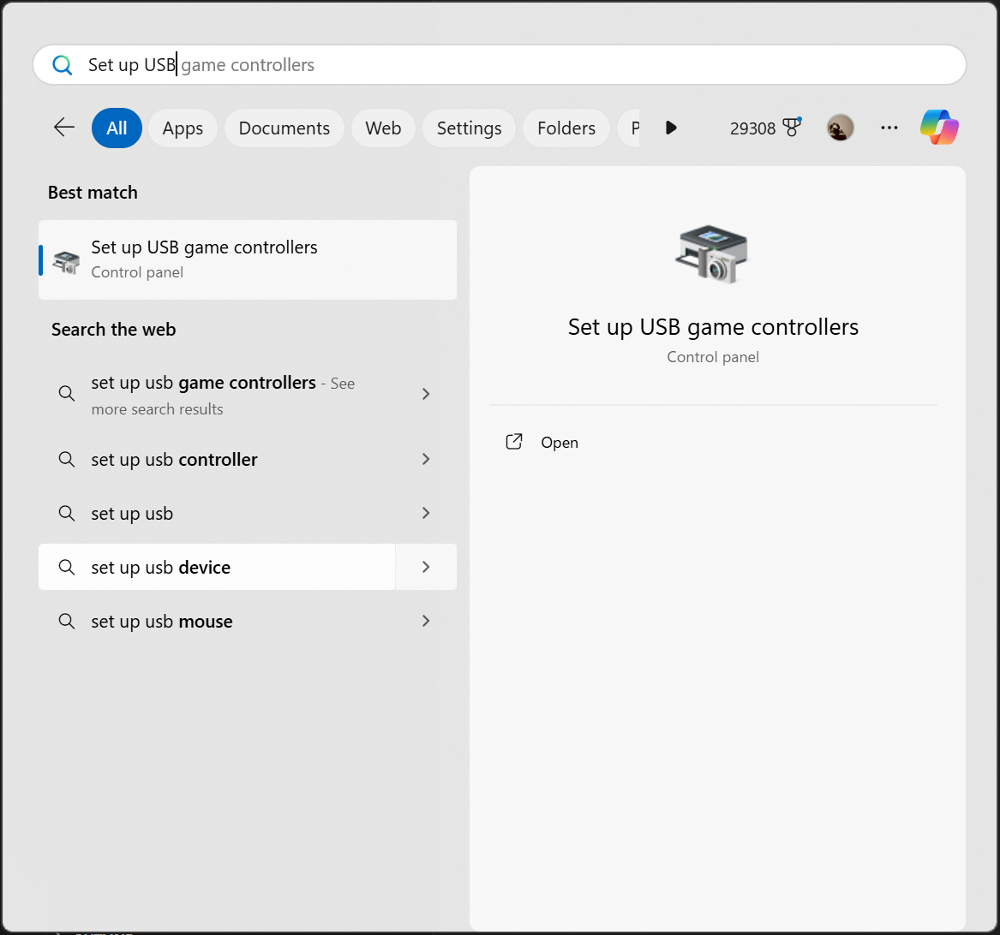
In order to test the game pad, you can go to the built-in Windows app. You can find this easily by typing as shown.

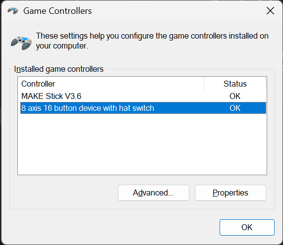
Once you start the app, it lists all the controllers connected to the computer. I have a fight stick that I bought, which is the first one on the list, so ignore that. The one I have built using ESP32 shows up as `8 Axis 16 button device with hat switch`. This name is completely random and I am not sure where it is coming from, but I do not care if I have only one to deal with. You can potentially change this name using Registry Editor by find all occurances and replace them. But we are here to test this thing, not to make it perfectly good everywhere.

Now if you double click the controllers in question, it shows the test dialog.

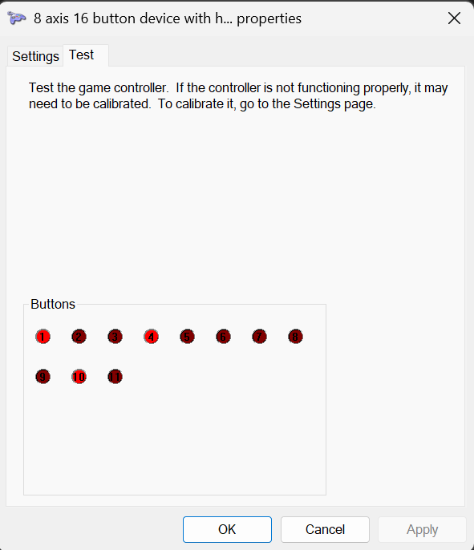
The second tab has the test capability for all the controls in the game pad. Just press the switches around and see each button circle is lit up. As I mentioned earlier, I made the software to report 11 buttons to take the full advantage of all the available pins, but I only wired 10 buttons to make the end product look tider. I am going to fully reuse the Arduino code in the future so it has 11 buttons instead of 10.

## Software
There are some goals and requirements for this section
- Controlling OBS using a gamepad
- Software will be built mostly using AI code agents(Vibe Coding)

### Research(On going)
I was about the design a background service that detects game pad inputs and convert them into OBS websocket commands. It will only be designed for Windows OS, because I am not planning to use it in other OSes.

However, I found that the background services do not have access to the HID devices like Gamepad. This changes the design to generate an app to do the same work instead of a background service.

General flow of the software
- User input from a gamepad
- Detect button
- WebSocket API to OBS to run a command necessary

